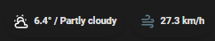

# WeatherXM-Home-Assistant
Extract weather data from any weatherXM station via api calls in Home Assistant.

# This implementation will create the following sensors:
* weather condition (sunny, cloudy, partly cloudy, rainy).
* temperature
* temperature real feel
* humidity
* wind speed km/h - m/h
* wind gust km/h - m/h
* pressure hpa
* wind direction
* wind direction cardinal
* precipitation
* uv_index
* icon 
* icon color

# How it works?
* navigate to [WeatheXM Explorer](https://explorer.weatherxm.com/).
* pick the station you want.
* in the website url copy the highlighted text after the # (in yellow).

* replace the (*****) with the text you copied.

  https://api.weatherxm.com/api/v1/cells/*****/devices

  we need this url for the api call.
* now paste the folowing [code](sensors.yaml) to your **sensors.yaml** and replace the url in line 3 with yours.
* make sure you add this line to your configuration.yaml
sensor:

`!include sensors.yaml`
* if the station you want is the second one in the HEX, then change the [0] with [1] in line 6.
* restart Home assistant and you're done, now weather station data is avalible in your home assistant and you're free to use it.

### Big portion of the code was inpired by [arcidodo](https://github.com/arcidodo) Thanks to him, [link](https://github.com/arcidodo/WeatherXM-Home-Assistant) to his repo.

# Enjoy
